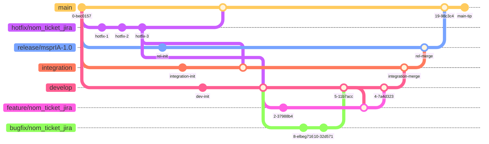

# GitFlow - Workflow

## Schéma des branches

---

## Description des branches

### `main`

Branche de **production**. Elle contient uniquement le code stable et déployé en production. On ne code jamais directement dessus. Toutes les autres branches permanentes sont tirées depuis `main`.

- **Source :** —
- **Merge vers :** elle-même (via release ou hotfix)
- **Convention de nommage :** `main`

---

### `release/msprIA-X.Y`

Branche de **préparation d'une release**. Elle est créée depuis `main` quand le périmètre fonctionnel d'une version est figé. Elle sert à stabiliser, corriger des bugs mineurs et préparer le déploiement.

- **Source :** `main`
- **Merge vers :** `main` (après validation finale)
- **Convention de nommage :** `release/NomProjet-X.Y` — ex : `release/msprIA-1.0`

---

### `integration`

Branche d'**environnement de test**. Elle reçoit les développements validés depuis `develop` pour être testés avant la mise en release. Elle permet de valider les fonctionnalités dans un environnement proche de la production.

- **Source :** `main`
- **Merge vers :** `release/...`
- **Convention de nommage :**  `integration`

---

### `hotfix/nom_ticket_jira`

Branche de **correction urgente**. Elle est créée directement depuis `main` pour corriger un bug critique en production sans passer par le cycle de développement normal. Une fois corrigée, elle est **rapatriée sur toutes les branches** (main, release, integration, develop).

- **Source :** `main`
- **Merge vers :** `main`, `release/...`, `integration`, `develop`
- **Convention de nommage :** `hotfix/nom_ticket_jira` — ex : `hotfix/IN-001_correction_login`

---

### `develop`

Branche de **développement principal**. Elle intègre toutes les nouvelles fonctionnalités terminées. C'est la branche de référence pour les développeurs au quotidien.

- **Source :** `main`
- **Merge vers :** `integration`
- **Convention de nommage :** `develop`

---

### `feature/nom_ticket_jira`

Branche de **développement d'une fonctionnalité**. Chaque nouvelle feature est développée dans sa propre branche isolée, puis mergée dans `develop` une fois terminée et validée.

- **Source :** `develop`
- **Merge vers :** `develop`
- **Convention de nommage :** `feature/nom_ticket_jira` — ex : `feature/IN-1_authentification_oauth`

---

### `bugfix/nom_ticket_jira`

Branche de **correction de bug non critique**. Elle corrige un bug identifié pendant le développement (pas en production). Elle peut être tirée depuis `develop` ou depuis une `feature` si le bug est lié à celle-ci.

- **Source :** `develop` ou `feature/...`
- **Merge vers :** branche source (`develop` ou `feature/...`)
- **Convention de nommage :** `bugfix/nom_ticket_jira` — ex : `bugfix/IN-2_correction_formulaire`

---

## Pattern GitFlow — Cycle de vie complet

```
main
 │
 ├──► release/X.Y        (préparation version)
 │
 ├──► integration               (validation QA)
 │
 ├──► hotfix/XXX         (correction urgente prod)
 │         └──► merge → main + release + integration + develop
 │
 └──► develop            (intégration continue)
           │
           ├──► feature/X    (nouvelle fonctionnalité)
           │         └──► merge → develop
           │
           └──► bugfix/X     (correction bug dev)
                     └──► merge → develop
```

### Flux standard d'une fonctionnalité

1. Créer `feature/nom_ticket_jira` depuis `develop`
2. Développer et commiter sur la feature
3. Merger la feature dans `develop`
4. Merger `develop` dans `integration` pour validation QA
5. Merger `integration` dans `release/X.Y`
6. Merger `release/X.Y` dans `main` pour le déploiement

### Flux d'un hotfix

1. Créer `hotfix/nom_ticket_jira` depuis `main`
2. Corriger le bug, commiter
3. Merger le hotfix dans **`main`** → déploiement immédiat
4. Rapatrier le hotfix dans **`release/...`**, **`integration`**, **`develop`** pour garder la cohérence

---

## Règles générales

- On ne commit **jamais** directement sur `main`, `release`, `test` ou `develop`
- Toute modification passe par une **Pull Request / Merge Request**
- Les branches `feature` et `bugfix` sont **supprimées** après merge
- Les branches `hotfix` sont **supprimées** après avoir été rapatriées partout
- Les branches `release` sont **archivées** (ou supprimées) après le déploiement
