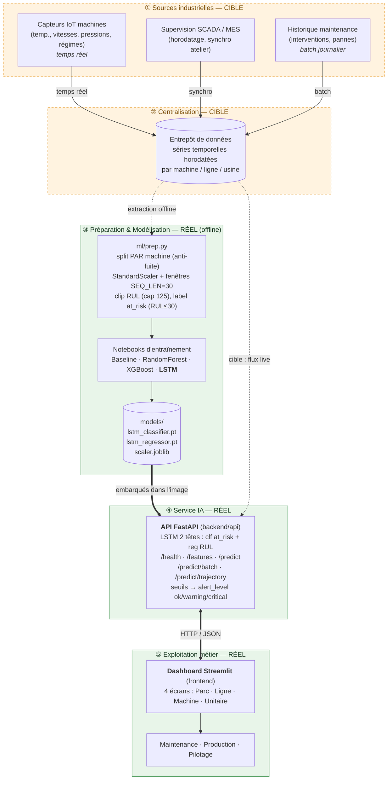

# Schéma d'architecture de la solution (MECHA / MSPR TPRE841)

> Livrable CDC §8.2 : *« Schéma d'architecture : sources de données, flux, composants de
> traitement et de modélisation, éléments d'exposition / restitution des résultats »* — décrit
> **et argumenté** au regard des contraintes industrielles de MECHA.

Ce document décrit l'architecture **cible** (environnement industriel MECHA) et distingue
clairement ce qui est **réellement implémenté dans le prototype** de ce qui est **décrit comme
perspective d'industrialisation**. Les volets détaillés vivent dans les docs dédiées :
[`repartition_donnees.md`](repartition_donnees.md) (sources/données), les `modele_*.md`
(modélisation), [`dashboard_technique.md`](dashboard_technique.md) (exposition/restitution).

---

## 1. Vue d'ensemble en couches

L'architecture suit l'enchaînement imposé par le CDC : **collecte → centralisation →
exploitation**. On la lit en cinq couches, de la source industrielle jusqu'à l'écran métier.



> **Légende.** Vert plein = **implémenté** dans le prototype ; orange pointillé = **cible
> industrielle** décrite (remplacée dans le prototype par le jeu C-MAPSS). Trait plein = flux
> actif ; pointillé = flux cible / offline.

---

## 2. Périmètre : ce que le prototype implémente réellement

| Couche CDC | Cible industrielle MECHA | Implémentation prototype |
|---|---|---|
| **Sources** | Capteurs IoT + SCADA/MES + historique maintenance | Jeu **NASA C-MAPSS** renommé au vocabulaire MECHA (`machine_id`, `usine`, `ligne_production`, `cycle`) — 21 capteurs + 3 réglages, cf. [`repartition_donnees.md`](repartition_donnees.md) |
| **Centralisation** | Entrepôt de données / stockage intermédiaire | Fichiers CSV versionnés dans `assets/KaggleDataset/` (train clf, train RUL, test, RUL vérité terrain) |
| **Préparation** | Pipeline temps réel + batch sur l'entrepôt | `ml/prep.py` : split par machine, `StandardScaler` (fit **train only**), fenêtres glissantes `SEQ_LEN=30`, clip RUL |
| **Modélisation** | Ré-entraînement périodique | Notebooks → 4 modèles comparés, **LSTM** retenu ; artefacts `.pt` + `scaler.joblib` |
| **Service IA** | API exposée aux applications du SI | **FastAPI** `backend/api`, 5 endpoints REST, LSTM 2 têtes |
| **Restitution** | Tableaux de bord, alertes, notifications | **Dashboard Streamlit** 4 écrans, alertes `ok/warning/critical` |
| **Infra** | Déploiement multi-sites maîtrisé | **Docker Compose** (2 images) + CI **CircleCI** (tests + build) |

Ce découpage est **assumé** : le prototype démontre la chaîne *données → modèle → API →
exploitation* de bout en bout ; les blocs « sources temps réel » et « entrepôt » sont conçus mais
non déployés (aucune donnée réelle — contrainte de confidentialité du CDC).

---

## 3. Composants réels et flux

### 3.1 Chaîne offline (préparation + modélisation)

Exécutée **hors ligne**, elle produit les artefacts embarqués dans le service :

```
assets/KaggleDataset/*.csv
   │  ml/prep.py  (split par machine → anti-fuite, StandardScaler fit sur train,
   │               fenêtres glissantes SEQ_LEN=30, clip RUL cap=125, label at_risk=RUL≤30)
   ▼
notebooks/  (01_random_forest · 02_gradient_boosting_baseline · 03_lstm)
   │  entraînement + évaluation (métriques comparées : cf. docs/README.md)
   ▼
models/  lstm_classifier.pt · lstm_regressor.pt · scaler.joblib
```

> **Anti-fuite temporelle** : le split se fait **par machine** (une machine = une trajectoire
> run-to-failure), jamais à cheval — indispensable pour une estimation honnête du RUL. Le
> `StandardScaler` est ajusté **uniquement sur le train** puis re-sérialisé, garantissant que
> l'inférence reproduit à l'identique le prétraitement d'entraînement.

### 3.2 Chaîne en ligne (service + exploitation)

```
CSV cycles machines ──▶ dashboard.py ──HTTP/JSON──▶ FastAPI ──▶ LSTM (clf + reg)
   (frontend/ui)          (Streamlit)   api_client   backend/api    models/
        ▲                                                 │
        └──────────────── alertes / KPI / trajectoires ◀──┘
```

- **Backend `backend/api`** — charge scaler + 2 LSTM **une seule fois** au démarrage
  (`ModelService.load`, `lifespan`) ; renvoie une prédiction *(at_risk, RUL, alert_level)*.
  Le contrat d'entrée (24 variables ordonnées) est publié par `/features`.
- **Frontend `frontend/ui`** — **découplé de l'IA** : ne charge **aucun modèle**, n'importe ni
  `ml/` ni `torch`, consomme exclusivement l'API. Structure `screen/` · `style/` · `utils/`
  (cf. [`dashboard_technique.md`](dashboard_technique.md)).

### 3.3 Endpoints d'exposition (mécanisme d'intégration IA ↔ appli)

| Endpoint | Rôle | Écran consommateur |
|---|---|---|
| `GET /health` | Vivacité + **publication des seuils métier** | barre latérale (+ paramètre les repères) |
| `GET /features` | Contrat d'entrée (24 variables/cycle) | — |
| `POST /predict` | Une machine, état courant | Analyse unitaire |
| `POST /predict/batch` | Un parc/une ligne, une prédiction par machine | Parc, Ligne |
| `POST /predict/trajectory` | Une machine, prédiction **cycle par cycle** | Fiche machine |

### 3.4 Paramétrage & règles métier (seuils / alertes)

Les seuils ne sont **pas codés en dur côté front** : ils proviennent de `/health`
(`ml/prep.py` + `backend/api/inference.py`) et pilotent la hiérarchisation des alertes :

| Paramètre | Valeur | Rôle |
|---|---|---|
| `RISK_THRESHOLD` | 30 cycles | `at_risk = 1 si RUL ≤ 30` (label + décision) |
| `CRITICAL_RUL` | 15 cycles | seuil de criticité (= seuil/2) |
| `CRITICAL_PROBA` | 0.75 | proba de risque déclenchant la criticité |

Règle appliquée (`_alert_level`) : `not at_risk → ok` · `at_risk & (RUL≤15 ou proba≥0.75) →
critical` · sinon `warning`.

---

## 4. Flux temps réel / batch (nature des données)

Conformément au schéma du CDC, deux régimes cohabitent :

- **Temps réel** — les cycles machines (capteurs) alimentent l'inférence à la demande
  (`/predict`, `/predict/batch`). Le LSTM raisonne sur une **fenêtre glissante des 30 derniers
  cycles**, ce qui impose la **cohérence temporelle** (horodatage, ordre des cycles) exigée par
  le CDC pour détecter les dérives.
- **Batch** — l'historique de maintenance et le ré-entraînement périodique des modèles se font
  hors ligne (chaîne §3.1), à fréquence maîtrisée.

---

## 5. Justification des choix (au regard des contraintes MECHA)

| Choix | Alternative écartée | Justification métier / technique |
|---|---|---|
| **Architecture en services découplés** (API ↔ front) | App monolithique embarquant le modèle | Le CDC impose l'IA **exposée en service** ; permet de faire évoluer le modèle sans toucher au front, et de réutiliser l'API pour d'autres clients (SCADA/MES, notebooks, tests). Tolérance aux pannes et déploiement indépendant. |
| **FastAPI** | Flask | Validation d'entrée native (Pydantic → 422 sur contrat non respecté), `/docs` OpenAPI auto, async — adapté à un contrat de données strict et à l'intégration SI. |
| **LSTM** retenu (2 têtes) | RF / XGBoost / baseline | Exploite la **temporalité** des trajectoires machines ; meilleures métriques sur les deux tâches (cf. [`README.md`](README.md)). RF/XGBoost conservés comme **comparateurs** exigés par le CDC. |
| **Streamlit** | Dash / Power BI | Prototypage rapide d'un dashboard Python cohérent avec la stack data ; suffisant pour démontrer l'exploitation métier. |
| **Docker Compose** | Déploiement manuel | Environnement standardisé reproductible (imposé CDC) ; backend **auto-porté** (torch CPU + artefacts embarqués), healthcheck, front démarré après backend *healthy*. |
| **CircleCI** | GitHub Actions / GitLab CI | Chaîne minimale imposée : lance les tests **puis** build les images (+ contrôle de merge, scan de secrets gitleaks). |
| **Fenêtre glissante SEQ_LEN=30** | Fenêtre plus longue / cycle unique | Compromis historique suffisant ↔ réactivité ; left-padding pour les machines à trajectoire courte, cohérent train/inférence. |

---

## 6. Infrastructure & déploiement

```
docker compose up --build   (depuis Tom/)
 ├─ backend  (Dockerfile.backend)  → :8000  torch CPU + artefacts LSTM embarqués · healthcheck /health
 └─ frontend (Dockerfile.frontend) → :8501  MECHA_API_URL=http://backend:8000 · démarre si backend healthy
```

- **Backend auto-porté** : aucune dépendance à un volume de modèles → image déployable telle
  quelle sur n'importe quel site.
- **CI CircleCI** (`.circleci/config.yml`) : `test-ia` (20 tests pytest : intégration API,
  unitaires, dictionnaire de données) puis `build-images`.
- **Perspective multi-sites** (cible) : une instance du service par usine, alimentée par
  l'entrepôt local, remontant les KPI vers un pilotage central — cohérent avec l'intégration
  progressive dans la supervision existante (SCADA/MES).

---

## 7. Limites & prérequis (industrialisation)

- **Sources temps réel non branchées** : le prototype lit des CSV. Le chemin temps réel est
  toutefois **démontré** par `sim/producer.py` (rejeu cadencé du CSV vers l'API, cf.
  [`mlops.md`](mlops.md)) ; l'industrialisation remplace ce rejeu par un connecteur
  IoT/SCADA → entrepôt (Kafka / passerelle OPC-UA, à cadrer).
- **Ré-entraînement** : industrialisé en commande unique reproductible (`ml/train.py`) avec
  **gate qualité en CI** (`ml/validate_metrics.py`) ; reste à ajouter l'orchestration
  planifiée et le monitoring de dérive (cf. [`mlops.md`](mlops.md) §5).
- **Dataset C-MAPSS** : trajectoires run-to-failure de turbines, **transposées** au vocabulaire
  MECHA — représentatif du *pattern* de dégradation, pas du parc réel (biais assumé, cf.
  [`repartition_donnees.md`](repartition_donnees.md)).
- **Prérequis de déploiement** : Docker sur chaque site, accès réseau front→API, horodatage
  fiable des cycles (cohérence temporelle).
